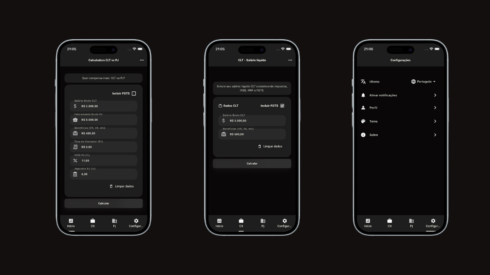
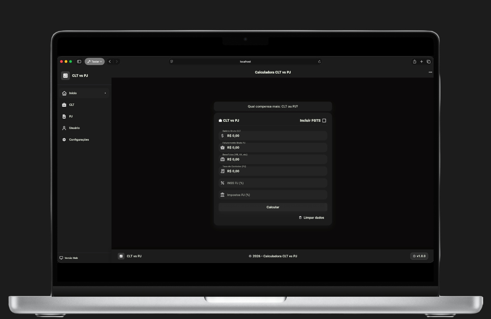

<h1 align="center" id="header">
  CLT vs PJ App - Flutter Multi-Platform Application
</h1>

<p align="center">
  
  
  
  
  
</p>

<p align="center">
  A multi-platform financial comparison tool for CLT vs PJ in Brazil. Built with Flutter, featuring responsive UI, multi-language support, and browser extension capabilities.
</p>

---

<h2 id="stack">
  Tech Stack
</h2>

<p>


</p>

### Core Technologies

- **Dart** - Programming language
- **Flutter** - Cross-platform UI framework
- **Material Design 3** - Modern design system
- **Provider** - State management solution

### Features & Integrations

- **Multi-Platform Support** - Android, iOS, Web, Chrome Extension
- **Google Fonts** - Beautiful typography
- **i18n** - Multi-language support (EN / PT-BR / ES)
- **Dark Mode Provider** - Theme switching
- **Flutter Local Notifications** - Push notifications
- **App Settings** - User preferences management
- **URL Launcher** - External link handling
- **Timezone Initialization** - Time zone support
- **Flutter Secure Storage** - Encrypted local storage
- **Shared Preferences** - Local persist
- **PieChart** - Data visualization
- **PDF Export / Printing** - Document generation
- **Makefile Automation** - Build automation
- **GoRouter** - Declarative routing with adaptive navigation (mobile/desktop)
- **Sentry Logs** - Error tracking and monitoring

---

<h2 id="prerequisites">
  Prerequisites
</h2>

Before starting, ensure you have the following installed:

- [FVM (Flutter Version Management)](https://fvm.app/documentation/getting-started/installation) - Required for managing Flutter versions
- [Git](https://git-scm.com/)
- [Xcode](https://developer.apple.com/xcode/) (for iOS development on macOS)
- [Android Studio](https://developer.android.com/studio) (for Android development)

> **Note**: This project uses **Flutter 3.38.4** managed through FVM. You don't need to install Flutter globally.

> Optional: [VS Code](https://code.visualstudio.com/) or [Android Studio](https://developer.android.com/studio) with Flutter plugins for IDE support.

---

<h2 id="installation">
  Installation & Setup
</h2>

### 1. Clone the Repository

```bash
git clone https://github.com/Victor-Zarzar/cltvspj
cd cltvspj
```

### 2. Open in your editor (example: Zed Editor)

```bash
zed .
```

### 3. Install Dependencies

```bash
make install
```

Or manually with Flutter:

```bash
flutter pub get
```

---

<h2 id="usage">
  Usage
</h2>

### Available Commands

View all available Make commands:

```bash
make help
```

### Local Development

#### Mobile (iOS Simulator)

Run on iPhone simulator:

```bash
flutter run -d "iPhone 17 Pro"
```

#### Mobile (Android Emulator)

Run on Android emulator:

```bash
flutter run -d android
```

#### Web (Web Server)

Start the web server:

```bash
flutter run -d web-server
```

Access the application at `http://localhost:xxxx`

#### Web (Chrome)

Run in Chrome browser:

```bash
flutter run -d chrome
```

### Extension Development

#### Build Web Extension (Development)

```bash
make build-extension-dev
```

#### Build Web Extension (Production)

```bash
make build-extension-prod
```

---

<h2 id="makefile-commands">
  Makefile Commands Reference
</h2>

### Development

| Command                    | Description                    |
| -------------------------- | ------------------------------ |
| `make install`             | Install Flutter dependencies   |
| `make build-web-dev`       | Build Web with Sentry (dev)    |
| `make build-extension-dev` | Build Web Extension (dev mode) |

### Production

| Command                     | Description                           |
| --------------------------- | ------------------------------------- |
| `make build-web-prod`       | Build Web with Sentry (production)    |
| `make build-extension-prod` | Build Web Extension (production mode) |

### Mobile Builds

| Command                        | Description                |
| ------------------------------ | -------------------------- |
| `make build-apk-release`       | Generate APK release       |
| `make build-appbundle-release` | Generate AppBundle release |
| `make build-ios-release`       | Generate iOS release       |

### Cleanup

| Command      | Description                                |
| ------------ | ------------------------------------------ |
| `make clean` | Clean Flutter cache and project temp files |

### Help Menu

| Command     | Description                 |
| ----------- | --------------------------- |
| `make help` | Show all available commands |

---

<h2 id="development">
  Development
</h2>

### Code Analysis

Check for code issues:

```bash
flutter analyze
```

### Testing

Run all tests:

```bash
flutter test
```

### Format Code

Format all files:

```bash
dart format .
```

---

<h2 id="project-structure">
  Project Structure
</h2>

```
cltvspj/
├── .github/                        # GitHub configuration
│   ├── workflows/                  # GitHub Actions workflows
│   │   └── main.yaml               # CI/CD pipeline
│   └── dependabot.yml              # Dependency updates configuration
├── lib/                            # Application source code
│   ├── models/                     # Data models
│   ├── providers/                  # State management
│   ├── screens/                    # UI screens
│   ├── widgets/                    # Reusable widgets
│   └── utils/                      # Utility functions
├── assets/                         # Static assets
│   ├── imgs/                       # Images and mockups
│   └── fonts/                      # Custom fonts
├── android/                        # Android platform code
├── ios/                            # iOS platform code
├── web/                            # Web platform code
├── test/                           # Unit and widget tests
├── Makefile                        # Build automation
├── netlify.toml                    # Netlify deployment config
├── pubspec.yaml                    # Flutter dependencies
└── README.md                       # Project documentation
```

---

<h2 id="screenshots">
  Screenshots
</h2>

### Project Mockup

<p align="center">
  
</p>

<p align="center">
  
</p>

### Project Architecture

<p align="center">
  
</p>

---

<h2 id="deployment">
   Deployment
</h2>

### Netlify (Web)

The project includes Netlify configuration for automated Flutter Web deployment:

- **`netlify.toml`** - Build configuration using `netlify-plugin-flutter`
- **CI/CD Pipeline** - `.github/workflows/main.yaml` for automated checks and builds
- **Dependabot** - Monthly dependency updates for GitHub Actions and Pub packages

Deploy to Netlify:

```bash
# The netlify.toml handles the build automatically
flutter build web --release
```

### Android (Google Play Store)

Build production APK with Sentry monitoring:

```bash
SENTRY_DSN=your-dsn-here SENTRY_ENV=production make build-apk-release
```

Build production AppBundle with Sentry monitoring:

```bash
SENTRY_DSN=your-dsn-here SENTRY_ENV=production make build-appbundle-release
```

The generated files will be at:

- APK: `build/app/outputs/flutter-apk/app-release.apk`
- AppBundle: `build/app/outputs/bundle/release/app-release.aab`
- Debug info: `build/debug-info/` (for Sentry symbolication)

### iOS (App Store)

Build production iOS app with Sentry monitoring:

```bash
SENTRY_DSN=your-dsn-here SENTRY_ENV=production make build-ios-release
```

The generated files will be at:

- IPA: `build/ios/ipa/`
- Debug info: `build/debug-info/` (for Sentry symbolication)

### Web

Build web version for production with Sentry monitoring:

```bash
SENTRY_DSN=your-dsn-here SENTRY_ENV=production make build-web-prod
```

Or build standard web version:

```bash
flutter build web --release
```

The generated files will be at: `build/web/`

### Chrome Extension

Build production extension:

```bash
make build-extension-prod
```

---

### CI/CD Workflow

Every push or pull request to `main` triggers automated:

- Code formatting verification (`dart format`)
- Static analysis (`flutter analyze`)
- Unit and widget tests (`flutter test`)
- Production web build

### Sentry Configuration

All production builds include:

- **Error tracking** with Sentry DSN
- **Code obfuscation** for security
- **Debug symbols** upload for crash symbolication

Make sure to:

1. Set your `SENTRY_DSN` from your Sentry project
2. Upload debug symbols to Sentry after each release for proper stack traces
3. Keep `build/debug-info/` directory for symbolication

---

<h2 id="contributing">
  Contributing
</h2>

Contributions are welcome! Please feel free to submit a Pull Request.

1. Fork the project
2. Create your feature branch (`git checkout -b feature/AmazingFeature`)
3. Commit your changes (`git commit -m 'Add some AmazingFeature'`)
4. Push to the branch (`git push origin feature/AmazingFeature`)
5. Open a Pull Request

---

<h2 id="license">
  License
</h2>

This project is licensed under the MIT License - see the [LICENSE](LICENSE) file for details.

---

<h2 id="contact">
  Contact
</h2>

Victor Zarzar - [@Victor-Zarzar](https://github.com/Victor-Zarzar)

Project Link: [https://github.com/Victor-Zarzar/cltvspj](https://github.com/Victor-Zarzar/cltvspj)

---

<p align="center">
  Made with by Victor Zarzar
</p>
