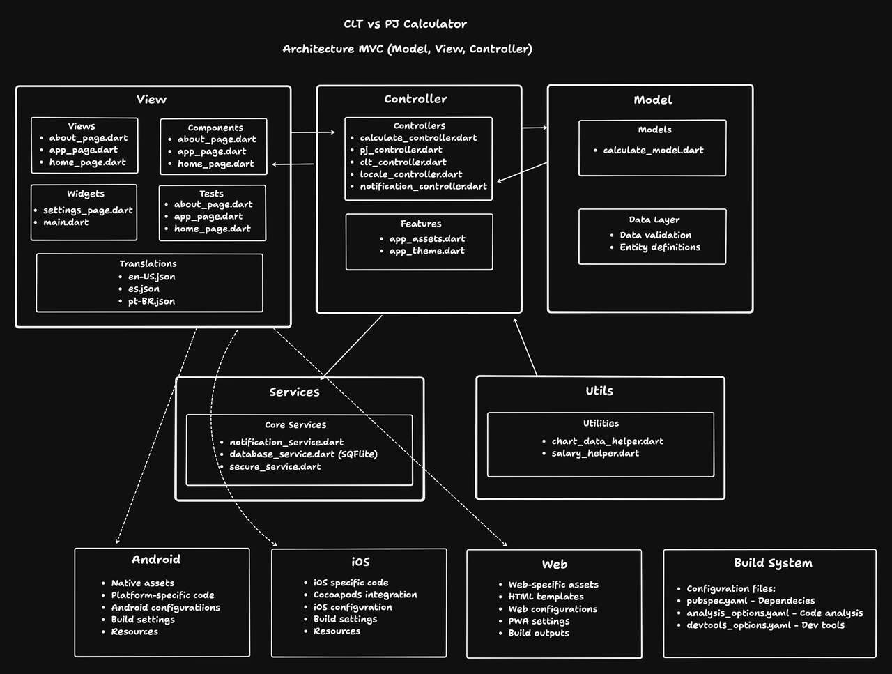

# CLT Vs PJ App • Flutter (Android / iOS / Web / Chrome Extension)

A multi-platform financial comparison tool for CLT vs PJ in Brazil.  
Built with Flutter, responsive UI, multi-language support and browser extension output.

---

## Tech Stack

- **Dart**
- **Flutter**
- **Material Design 3**
- **Google Fonts**
- **Localization:** EN / PT-BR / ES
- **Dark Mode Provider**
- **Flutter Local Notifications**
- **App Settings**
- **URL Launcher**
- **Timezone Initialization**
- **Provider (State Management)**
- **Flutter Secure Storage**
- **SQFlite**
- **PieChart**
- **PDF Export / Printing**
- **Makefile Automation**
- **Sentry Logs**

---

## Installation

### 1. Clone the project

```bash
git clone https://github.com/Victor-Zarzar/cltvspj
cd cltvspj
```

### 2. Open in your editor (example: Zed Editor)

```bash
zed .
```

### 3. Install dependencies

Using Makefile:

```bash
make install
```

Or manually:

```bash
flutter pub get
```

---

## Running the App

### Mobile (MacOS) / Desktop

```bash
flutter run -d "iPhone 17 Pro"
```

### Web (Web Server)

```bash
flutter run -d web-server
```

Open the browser at: `http://localhost:xxxx`

### Web (Chrome – default)

```bash
flutter run -d chrome
```

---

## Mockup Images


---

## Project Architecture



---

## Makefile Commands

The project includes a complete Makefile for automating builds and maintenance.

### Development

| Command                    | Description                    |
| -------------------------- | ------------------------------ |
| `make install`             | Install Flutter dependencies   |
| `make build-extension-dev` | Build Web Extension (dev mode) |

### Production

| Command                     | Description                           |
| --------------------------- | ------------------------------------- |
| `make build-extension-prod` | Build Web Extension (production mode) |

### Mobile Builds

| Command                        | Description                |
| ------------------------------ | -------------------------- |
| `make build-apk-release`       | Generate APK release       |
| `make build-appbundle-release` | Generate AppBundle release |
| `make build-ios-release`       | Generate iOS release       |

### Cleanup

| Command      | Description                                |
| ------------ | ------------------------------------------ |
| `make clean` | Clean Flutter cache and project temp files |

### Help Menu

```bash
make help
```

Displays all available Makefile commands with descriptions.
